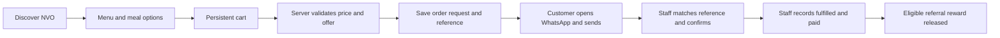

# Website and delivery plan

Prepared 24 September 2026. Full scope is retained; stages below order the work rather than remove requirements. Production implementation begins after this research phase.

## Product direction

Build a premium restaurant experience backed by a usable staff system: discovery, menu exploration, order requests, confirmed fulfillment, return visits and referrals. Keep the customer journey simple while allowing staff to manage content, offers and measurement.

Working visual direction: deep blue for navigation and selected feature areas, generous white space for menu readability, restrained gold for highlights, and authentic food photography. Use an elegant display typeface with a highly readable body font and full French accent support. Suggested palette for exploration, not sampled official values: navy #101A44, royal blue #2022A8, warm white #FAF8F3, gold #C9A34C. Validate contrast for the actual text/button combinations. Do not rely on gold text on white.

Use a split hero with one strong food photograph rather than a busy flyer or low-resolution full-screen video. Draft copy direction: “Seafood & Nigerian favourites, served with NVO flavour.” Translate and refine with the owner; avoid unsupported claims about awards, ingredients, ratings or service speed.

Mobile priorities: fast menu access, readable prices, easy variants and quantities, a persistent cart count, clear WhatsApp handoff and directions. Aim for 44-pixel touch targets, keyboard usability, visible focus, proper labels and reduced-motion support. A short optional reveal or add-to-cart animation should not delay ordering.

## Public information architecture

### Admin-controlled prices and current specials

Owner clarification: public prices may be shown or hidden at the admin's choice. Provide a global price-visibility default with per-meal/variant overrides. Keep a private configured price separate from public visibility, and permit genuinely unpriced items in quote-request mode. Missing prices are null, never zero.

For priced visible items, show validated amounts and totals. For hidden-price or unpriced items, retain meal selection and quantity controls and label the action “Request on WhatsApp” / “Ask for price”. A mixed cart may show a clearly labeled subtotal for visible-price items, but its grand total remains “To be confirmed”. Generated WhatsApp text lists all selected items and quantities and requests pricing for hidden/unpriced items. Never leak hidden prices through public JSON, page source, structured data, share metadata or generated messages; suppress discount amounts that would reveal them. Staff may retain access to private prices.

Coupons remain claimable where their campaign permits it, but minimum spend and monetary savings in an unpriced request remain pending a staff-confirmed quote. A free named-item reward can show its benefit without inventing a price. Admin should see warnings when an offer depends on missing private prices. Test all-visible, all-hidden, mixed and genuinely unpriced carts, plus a visibility change while a cart is open. Publish changes must invalidate cached public price data.

Give current special meals their own managed feature: item selection, title, description, image, start/end, availability, display order, badge and optional visible price/discount. A special need not be discounted. Surface valid specials on the homepage and menu, with a dedicated collection if useful; automatically remove expired specials from active promotion slots. Staff can turn them on/off without developer changes.

### Location and Google Maps

Owner-confirmed locality: Commissariat, Agblangandan, Cotonou. Owner-confirmed WhatsApp: +229 50924184. Store the WhatsApp link target as digits `22950924184`, editable by an authorized admin; do not silently alter it. Test recipient routing before launch.

Plan a responsive Google Maps embed on Contact and the home location section, plus an Open in Google Maps / Get directions action. Use an owner-verified restaurant Place ID or exact pin, not the nearby commissariat or a hotel. Store display address, landmark instructions, Maps share URL, Place ID, coordinates and verification status separately. No exact NVO pin has been verified in research; a search URL is only a discovery aid, not confirmed directions.

Google documents iframe place embeds using an address or Place ID and an API key. If that API is chosen, apply website/API restrictions to its browser-visible key and load the map lazily with an accessible title and text address fallback. Browser map keys are deliberately public restricted credentials, unlike private server secrets. Confirm the final location visually before release. [Google Maps Embed documentation](https://developers.google.com/maps/documentation/embed/embedding-map)

Use Google's documented cross-platform Maps URLs for external directions, with the verified destination and Place ID where available. [Maps URL documentation](https://developers.google.com/maps/documentation/urls/get-started)

| Page / route concept | Purpose |
| --- | --- |
| Home | Identity, featured food, order/menu actions, valid current offer, upcoming event, short story, approved social proof, directions |
| Menu + meal detail | Managed categories, search/filter, prices, variants, availability, descriptions, optional ingredients/preparation, quantities and cart |
| Cart | Persistent items, validated discount, price changes, fulfillment details and WhatsApp request |
| Promotions + individual campaign | Accurate availability, offer terms and claim action |
| Offers wallet | Personal claimed, pending, available, expired and redeemed rewards |
| Referral + /r/:code | Create/share an invitation; eligible friend claims; track pending/earned reward |
| Reservations | Name, phone, date, time, party size and optional message; explicit request status |
| Events + event detail | Upcoming event information, request/booking CTA and past archive |
| News + individual post | Announcements, meals, useful updates, publish/expiry handling |
| About | Verified brand story, real people and experience |
| Gallery | Curated approved media with accessible captions |
| Loyalty / customer recognition | Monthly top three, previous months and consented names/photos |
| Testimonials | Only genuine approved customer feedback |
| Contact | Confirmed address, opening hours, phone, Maps, service conditions |
| Privacy + offer/general terms | Clear data practices and actual offer/service rules |

Proposed navigation: Menu, Offers, Events, About, Contact, with Order as the main action. Home via logo; news, gallery and recognition accessible through secondary navigation. Mobile bottom navigation can use Menu, Offers, Cart, More; hide redundant order controls inside checkout. Optional homepage sections disappear gracefully when there is no valid content.

Plan locale routes such as /fr/menu and /en/menu; keep /r/:code stable and redirect to the customer's chosen language. Marketing pages may be indexed; private wallets, admin, cart and referral tokens must not become indexed content. Sitemap includes only published canonical public content.

## Customer order and staff confirmation

The browser cannot verify the send action in F. Record the outbound click, then wait for staff confirmation. Use states such as request_created, whatsapp_handoff_clicked, accepted, fulfilled, cancelled, with a separate payment status. Staff confirmation is an audited business record, not independent payment-provider verification. Count a sale only under the agreed fulfilled/paid definition.

Capture dine-in/pickup/delivery needs according to supported services. If delivery cost is unknown, label the food subtotal and delivery “to be confirmed”; do not present an invented final total. Price quotes and reward holds have server-side expiry. Revalidate after a long pause, show changed prices, and retain the cart when the customer returns from WhatsApp.

Reservations have a separate request/confirmed/cancelled lifecycle; never claim an available table from a request alone. Persist the request before WhatsApp handoff so authorized staff can find it.

## Staff experience

Owner/Admin: all configuration, users, roles, integrations, audited reversals and reports. Manager: meals, orders, reservations, content, offers and reporting within assigned permissions. Content Manager: posts, events, approved media and publishing. Customer Service: order/reservation follow-up and permitted redemption. Analyst: aggregate reports without unnecessary customer personal data.

Admin modules: overview; meals/categories/variants; order requests; reservations; promotions/coupons/drops; referrals; posts/events; media; testimonials; top-three recognition; campaigns/UTM links; social connections/publishing queue; AI drafts; notifications; analytics; settings/users/audit log.

Menu categories must support create, rename, reorder and hide. Archive categories used by historical orders rather than breaking history. Snapshot prices and item names on orders. Store image alt text and localized text in the CMS. Show useful empty states and real data rather than decorative dashboard totals.

Onboarding: restaurant details → logo/brand → WhatsApp → menu → social accounts → offers/referrals → analytics/privacy → preflight preview → publish readiness. Check missing values explicitly.

## Proposed technical foundation

Recommend a TypeScript React application using Next.js App Router, a managed PostgreSQL database, managed authentication and object storage, and a durable job worker. Supabase is a candidate for PostgreSQL/auth/storage; hosting/provider selection remains provisional until budget and account ownership are known. Avoid selecting services based on unverified free-tier assumptions.

Next.js documents server/client components, route handlers, metadata and image optimization, making it a suitable candidate for public discoverability and interactive ordering. [Next.js App Router](https://nextjs.org/docs/app)

Keep secrets and privileged writes on the server. Use database policies as defense in depth and server-side authorization on every mutation. Supabase documents PostgreSQL row-level security; define access policies explicitly and test them per role. [Supabase RLS](https://supabase.com/docs/guides/database/postgres/row-level-security)

Separate modules for catalogue, pricing, ordering, reservations, rewards, referrals, content, publishing, analytics and settings. Components call these services; business rules do not live in buttons. Persist cart locally for convenience, but never trust local prices, discounts or eligibility.

Suggested data groups:

| Domain | Core records |
| --- | --- |
| Identity | Staff profiles, role grants, customer identities, consents, audit events |
| Catalogue | Categories, meals, variants, options, localized content, availability, media |
| Commerce | Order requests, line snapshots, quote/hold records, status events, reservations |
| Rewards | Campaign versions, schedules/drop windows, reward definitions, issued coupons, claim limits, redemptions |
| Referrals | Links/invitations, eligible visits, claims, qualifying order associations, reward grants |
| Content | Posts, events, testimonials, recognition periods/winners, localization, media associations |
| Distribution | Connected accounts, protected tokens, platform drafts, publishing jobs and attempts |
| Measurement | Sessions, consent-aware events, campaign attribution, daily aggregates |
| Settings | Restaurant facts, locale/timezone/currency, messaging templates, SEO, notifications |

Use migrations, referential integrity, transaction-safe claims/redemptions, idempotent mutations and backups with a restore rehearsal. Rate-limit exposed endpoints and validate uploads by real format/size. Private customer records and tokens are never public media. Store provider secrets in environment variables; store editable ordinary business configuration in the database. Encrypt social authorization tokens at rest with a server-held key.

## Publishing and AI

Create/edit one post, then prepare distinct website, Instagram, Facebook and WhatsApp copy. Let staff preview, edit and approve each channel. For the initial WhatsApp channel, provide a prepared message/share action, not an unverified claim of automatic Status or broadcast publishing.

Website publication and social publication have independent outcomes. Use per-channel job states: draft, awaiting approval, scheduled, publishing, published, failed, cancelled. Save provider receipts/IDs, retry transient failures with bounded backoff, and prevent duplicate posts. Authentication failures should stop retry loops and show Reconnect. Revoking a connection cancels or blocks pending jobs as appropriate.

Meta's Instagram publishing and Pages API documentation URLs were attempted but returned HTTP 429 during research. Exact account eligibility, current permissions, review requirements, supported media and API versions must be verified during integration work. Do not promise automatic publishing to a personal profile or every social platform. Reference endpoints for later verification: [Instagram publishing](https://developers.facebook.com/docs/instagram-platform/content-publishing/), [Facebook Pages posts](https://developers.facebook.com/docs/pages-api/posts/).

AI generation is a server-side provider integration with quotas, failure handling and editable drafts. Bind generated copy to real restaurant/menu/campaign facts. Do not invent discounts, ingredients, opening hours, customer endorsements or health claims. Provider/model and costs remain unselected. Credentials and actual provider access are needed before this can be called tested.

Scheduled publishing needs a worker or scheduled service that runs independently of visitors. Request-time checks still prevent expired offers from being used if the scheduler is late. Keep durable records of attempts, failures and completion; notify staff about failures that require action.

## Measurement

| Layer | Examples | Meaning |
| --- | --- | --- |
| Traffic | Sessions, estimated unique visitors, source | Visits, with coverage limitations |
| Engagement | Meal views, menu use, promotion views, cart additions | Interest |
| Intent | Order request, WhatsApp handoff, directions/phone click, reservation request | Attempted action, not a sale |
| Confirmed outcomes | Staff-confirmed fulfilled/paid order, actual redemption, confirmed reservation | Recorded business outcome with provenance |
| Retention | Repeat confirmed orders by identified customer | Returning business within measured coverage |

Collect the events listed in the original brief, with event IDs, timestamps and schema validation. Separate a share-button click from a successfully returned device-share action; neither proves the friend received it. Sanitize UTM fields and exclude personal contact/message text from event payloads. Carry campaign attribution to order records without putting customer information in URLs. Identify how consent, blockers and anonymous visits affect visitor estimates.

Use clear denominators: claim rate = unique eligible claimants / eligible referral visitors; redemption rate = redeemed issued rewards / issued rewards; referral purchase rate = distinct qualified referred customers / eligible referred visitors. Always display date range and timezone. Compare reward cost, confirmed first orders and 30-day repeat rate when enough data exists. Revenue and profitability views require real price, payment and cost information; hide them when unavailable.

## Delivery stages and proof of completion

| Stage | Work | Exit evidence |
| --- | --- | --- |
| 0: Research and specification | Asset audit, sourced facts, architecture, campaign rules, pending business details | This research pack; unresolved facts clearly labeled |
| 1: Foundation and design | App setup, schema/migrations, auth/roles, storage, design tokens, locale structure, mobile and desktop key screens | Secure staff login, persisted settings, responsive public layout and approved content direction |
| 2: Ordering | Managed menu/categories/variants, public menu/detail/cart, server quotes, WhatsApp handoff, staff order/reservation ledger | Staff changes meal; customer orders with correct total; staff confirms outcome end to end |
| 3: Content and discovery | All editorial/public routes, media, posts/events, testimonials, top-three recognition, SEO and schedule handling | Staff publishes and schedules real content; website updates; expired content handled |
| 4: Rewards | Promotions, coupon builder, claim identity, drops, wallet/card download, referrals, redemption | Claim → save → activate → redeem; referral → qualifying order → reward; concurrency tests pass |
| 5: Distribution and insight | AI drafts, OAuth adapters, queue, notifications, analytics and attribution dashboard | Real integration checks where credentials exist; truthful unconnected states otherwise; verified event funnel |
| 6: Launch readiness | Full journey testing, performance/accessibility, backups, error monitoring, onboarding, documentation and production configuration | Build/checks pass, business facts verified, smoke tests and staff handover complete |

Cross-cutting security, accessibility and measurement start in stage 1. Do not wait until stage 6 to add them. External account setup should begin early because it can delay stage 5. This is a dependency sequence, not a completion-date estimate.

## Requirement coverage

| Original sections | Planned coverage |
| --- | --- |
| 1–4 | Brand, responsive visual system and homepage |
| 5–8 | Managed menu, persistent cart, WhatsApp order and reservation journeys |
| 9–13 | Promotions, coupons, referrals, separate claim/validity clocks and referral reporting |
| 14–18 | Posts, channel-specific publishing, connections, editable AI drafts and events |
| 19–20 | Top-three recognition and authentic testimonials |
| 21–25 | Acquisition events, analytics, UTM attribution, technical SEO and useful content |
| 26–30 | Admin, meal management, media, role permissions and notifications |
| 31–36 | Required public pages, navigation, mobile action, SEO, performance and accessibility |
| 37–42 | Security, persistent schema, truthful order states, WhatsApp configuration, secure referrals and settings |
| 43–45 | Publishing queue, scheduling and automatic expiry |
| 46–53 | Simple customer journey, purposeful homepage, restrained animation, empty/error/loading states and honest reporting |
| 54–56 | Maintainable React/server/database architecture, secret configuration and service boundaries |
| 57–60 | Journey/security tests, isolated demo content, onboarding and deployment checks |
| 61–63 | Full customer acquisition and staff workflows; working persistent systems and real integrations |
| Final free-form note | Configurable surprise drops, random schedules, claim caps, delayed activation/reveal, wallet and referral qualification |

## Validation and launch conditions

Test customer ordering, persistence, invalid/expired coupons, changed prices, unavailable meals, mobile WhatsApp handoff, reservations, referral timing and downloaded reward reuse. Integration tests must cover claim/redemption transactions and privileges; browser tests must cover real critical journeys. Test admin CRUD, publication scheduling, role restrictions and connected-account failures.

Check responsive layouts at representative 320, 375, 390, 768, 1024 and 1440-pixel widths, touch/keyboard use, screen-reader labels, zoom and reduced motion. Aim for LCP at or below 2.5s, INP at or below 200ms and CLS at or below 0.1 on real mobile traffic; these are proposed acceptance targets, not measured results. Use compressed responsive assets and defer nonessential scripts, maps and videos.

Separate demo fixtures from production. Any illustrative testimonials and winners must be visibly fictional in preview and excluded from public launch. Production analytics starts empty. Before launch, verify domain/TLS, secrets, migrations, backup restoration, real WhatsApp destination, truthful restaurant content and staff ownership of confirmations. Document each integration as tested, implemented-but-unconnected, or still pending.

Next working session: resolve core restaurant facts and present the mobile/desktop homepage, menu, cart and offers flow as a coherent first design, while establishing the persistent foundation. No website code or external services were created in this research phase.
